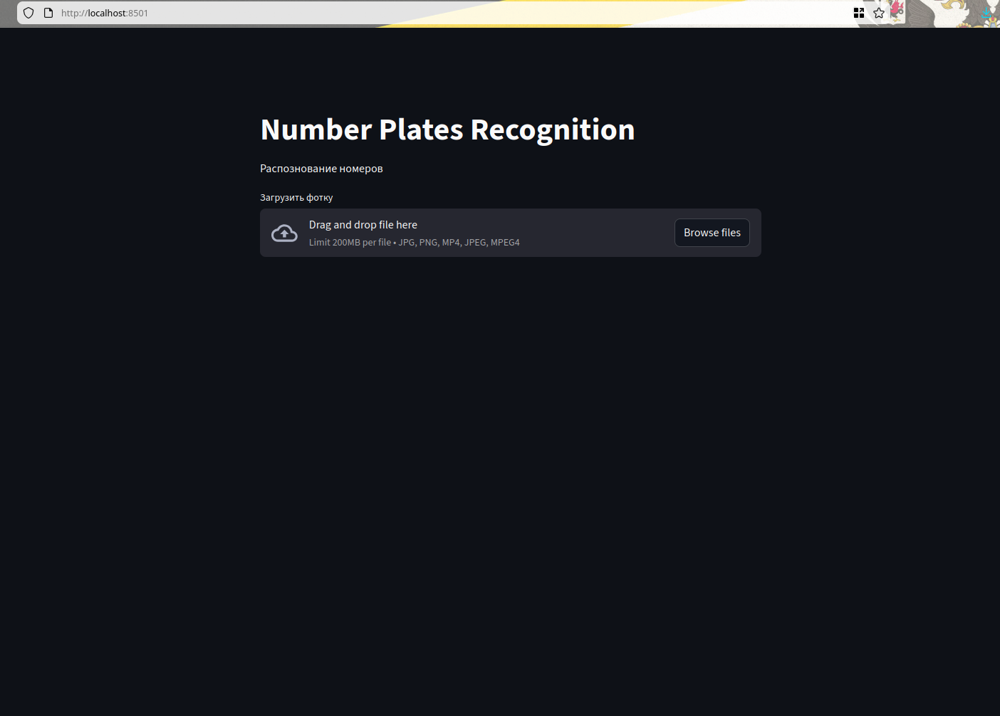

# 🚗 Number Plates Recognition (NPR)

Сервис распознавания автомобильных номеров на изображениях и видео  
на базе **FastAPI**, **Streamlit** и **YOLO8v**.

Проект позволяет:
- загрузить изображение или видео,
- распознать номерные знаки,
- получить координаты автомобилей и номеров,
- визуализировать результат с наложенными bounding box.

---

## 📸 Демонстрация

### Веб-интерфейс (Streamlit)


### Результат распознавания


---

## 🧠 Архитектура проекта

```text
.
├── npr_main
│   └── service.py       # FastAPI backend
│   └── model.py         # Функционал YOLO
│   └── model/           # ML / CV модель
│   └── requirements.txt # зависимости для service и model
├── npr_app
│   └── app.py           # Streamlit frontend
│   └── requirements.txt # зависимости для streamlir
├── docs/
│   └── images/          # Скриншоты для README
└── README.md
```

## ⚙️ Стек технологий

* Python 3.11

* FastAPI — backend API

* Streamlit — web-интерфейс

* YOLO8v — обработка изображений и видео

## 🛠 Установка проекта
```
git clone https://github.com/Bulbanator123/license_plate_recognition_project
cd license_plate_recognition_project
```
## 🚀 Запуск проекта

### 1️⃣ Установка зависимостей

``` text
cd npr_main
pip install -r requirements.txt
cd ../npr_app
pip install -r requirements.txt
cd ..
```

### 2️⃣ Запуск backend (FastAPI)
``` text
cd npr_main
uvicorn service:app --reload
```
Swagger-документация будет доступна по адресу:
``` text
http://127.0.0.1:8000/docs
```
3️⃣ Запуск frontend (Streamlit)
```
cd npr_app
streamlit run app.py
```

После запуска интерфейс откроется в браузере.

## Lisence
