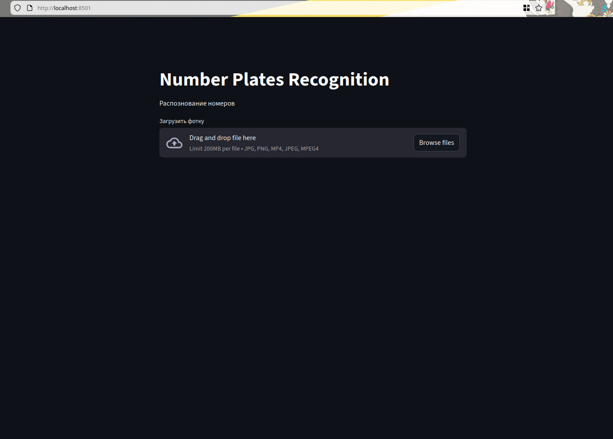

# 🚗 Number Plates Recognition (NPR)

Сервис распознавания автомобильных номеров на изображениях и видео  
на базе **FastAPI**, **Streamlit** и **YOLO8v**.

Проект позволяет:
- загрузить изображение или видео,
- распознать номерные знаки,
- получить координаты автомобилей и номеров,
- визуализировать результат с наложенными bounding box.

---

## 📸 Демонстрация

### Веб-интерфейс (Streamlit)


### Результат распознавания


---

## 🧠 Архитектура проекта

```text
.
├── npr_main
│   └── service.py       # FastAPI backend
│   └── model.py         # Функционал YOLO
│   └── model/           # ML / CV модель
│   └── requirements.txt # зависимости для service и model
├── npr_app
│   └── app.py           # Streamlit frontend
│   └── requirements.txt # зависимости для streamlir
├── docs/
│   └── images/          # Скриншоты для README
└── README.md
```

## ⚙️ Стек технологий

* Python 3.11

* FastAPI — backend API

* Streamlit — web-интерфейс

* YOLO8v — обработка изображений и видео

## 🛠 Установка проекта
```
git clone https://github.com/pivoslavik/license_plate_recognition_project
cd license_plate_recognition_project
```
## 🚀 Запуск проекта

### С помощью Docker

``` text
docker compose build
docker compose up
```

### Обычный

### 1️⃣ Установка зависимостей

``` text
cd npr_main
pip install -r requirements.txt
cd ../npr_app
pip install -r requirements.txt
cd ..
```

### 2️⃣ Запуск backend (FastAPI)
``` text
cd npr_main
uvicorn service:app --reload
```
Swagger-документация будет доступна по адресу:
``` text
http://127.0.0.1:8000/docs
```
3️⃣ Запуск frontend (Streamlit)
```
cd npr_app
streamlit run app.py
```

После запуска интерфейс откроется в браузере.

## Lisence

MIT License

Copyright (c) 2025 Bulbanator123

Permission is hereby granted, free of charge, to any person obtaining a copy
of this software and associated documentation files (the "Software"), to deal
in the Software without restriction, including without limitation the rights
to use, copy, modify, merge, publish, distribute, sublicense, and/or sell
copies of the Software, and to permit persons to whom the Software is
furnished to do so, subject to the following conditions:

The above copyright notice and this permission notice shall be included in all
copies or substantial portions of the Software.

THE SOFTWARE IS PROVIDED "AS IS", WITHOUT WARRANTY OF ANY KIND, EXPRESS OR
IMPLIED, INCLUDING BUT NOT LIMITED TO THE WARRANTIES OF MERCHANTABILITY,
FITNESS FOR A PARTICULAR PURPOSE AND NONINFRINGEMENT. IN NO EVENT SHALL THE
AUTHORS OR COPYRIGHT HOLDERS BE LIABLE FOR ANY CLAIM, DAMAGES OR OTHER
LIABILITY, WHETHER IN AN ACTION OF CONTRACT, TORT OR OTHERWISE, ARISING FROM,
OUT OF OR IN CONNECTION WITH THE SOFTWARE OR THE USE OR OTHER DEALINGS IN THE
SOFTWARE.
